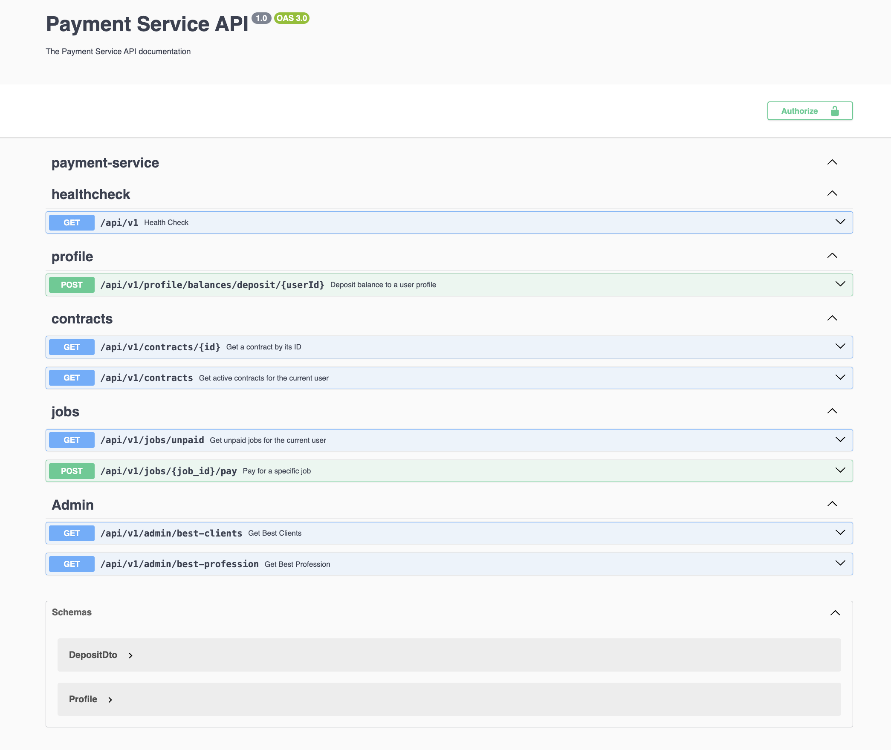

# Basic Payment Service

## Overview

This project is a case study designed as the final validation for the role of Payment Engineer. It demonstrates core skills and competencies essential for the role, including implementing transactions, handling race conditions, ensuring concurrency, adhering to SOLID principles and software design patterns, writing efficient and optimized database queries, and writing tests. The system is built using NestJS and PostgreSQL with TypeORM.

## Project Overview

The goal of this project is to demonstrate the ability to design, develop, and document a backend API. The application is built using the NestJS framework, leveraging an SQL database (PostgreSQL) for data persistence.

## Technologies Used

- **NestJS:** A progressive Node.js framework for building efficient, scalable server-side applications.
- **TypeScript:** A strongly typed programming language that builds on JavaScript.
- **PostgreSQL:** A powerful, open-source object-relational database system.
- **TypeORM:** An Object-Relational Mapping (ORM) library for TypeScript and JavaScript.
- **Swagger:** Integrated for comprehensive API documentation.

## Features

1. **User Authentication:**

   - Profiles are categorized as either clients or contractors.
   - Authentication middleware ensures that each request is associated with a valid profile.
   - Unauthorized access is handled with appropriate status codes.

2. **Contract Management:**

   - Clients can create contracts with contractors.
   - Contracts have statuses: new, in_progress, and terminated.
   - Only in_progress contracts are considered active.
   - Clients and contractors can view their associated contracts.

3. **Job Management:**

   - Contractors perform jobs for clients under specific contracts.
   - Clients can pay contractors for completed jobs, subject to balance constraints.
   - Only unpaid jobs for active contracts are retrievable.

4. **Admin Functionality:**
   - Admins can view the best-performing profession within a specified time range.
   - Admins can also view the top-paying clients within a given period.

## Implementation Details

The project is implemented using NodeJS, NestJS, TypeScript, and TypeORM for database interactions. PostgreSQL is used as the database.

## Getting Started

### Prerequisites

Ensure the following packages are installed locally:

1. [PostgreSQL](https://www.postgresql.org/download/)
2. [Node (LTS Version)](https://nodejs.org)
3. [NPM](https://docs.npmjs.com/downloading-and-installing-node-js-and-npm)
4. NestJS CLI: `npm install @nestjs/cli -g`

### Setup Steps

1. **Clone the repo**

   ```bash
   git clone https://github.com/ChuloWay/payment-service-api
   ```

2. **Create an env file:**

   - Duplicate the `.env.example` file in the project root.
   - Rename the duplicated file to `.env`.
   - Open the `.env` file and set your variables as shown in the example file.

   ```bash
   cp .env.example .env
   ```

   Ensure to fill in the necessary values in the `.env` file for a smooth configuration.

3. **Run Migration:**

   ```bash
   npm run apply:migration
   ```

4. **Start your server:**

   ```bash
   npm run start:dev
   ```

### Unit Tests

## `npm run test`

- Includes unit tests for Core Services using Jest.
- Tests cover CRUD operations, input validation, error handling and payments.

## API Documentation

Explore the API documentation at - [LOCALHOST] -- [Swagger](http://localhost:3000/api/v1/docs).



## Future Enhancements

In future iterations, I plan to implement a Queue System for handling all transactions. For this version, I opted to use database transactions due to the lightweight nature of the current requirements and the unknown scale of the target deployment. However, as the system scales, transitioning to a queue-based approach would better manage concurrency and ensure reliable processing under higher loads.

## Acknowledgements

Special thanks to:

- NestJS
- TypeScript
- PostgresSQL
- TypeORM
- Swagger

## Conclusion

Thank you for exploring our Payment Service System! Feel free to provide feedback, report issues, or contribute to the project. Happy coding!
